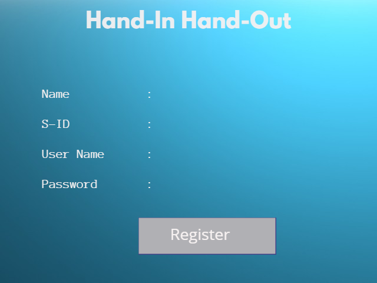

# Proposal for HAND-IN HAND-OUT

- Every university tend to hand out books to students based on their respective courses and intrests. If in case of books shortage or damaged books or other reasons the university tend to ask students to buy textbooks from other sources. After the year is done most of these books are either sold on other websites or students tend to recycle them. We intend to create an application to allow students to sell these books to the university on a certain percentage of the actual price so these books can be again issued by the university for new students.

 ## Overview:
 - We would like to develop an application that allows students to search for books they want to buy, rent, or check out, as well as sell them to the university. They will be given an appointment at their university library after filling out a form, where they can bring their book and sell it, which the admin will accept or reject depending on the book's availability.
 
 ## Benefits:
- This application would make it easy for students to check the availability of books that they would wish to check out or rent.
- Students can easily sell their books to the university.
- University can easily get more books, sometimes advanced editions from the students without spending more time to buy.

## Schedule:

### Sprint 1  (Start Date: 20 September 2021 - 4th October 2021)
- In sprint 1 we work with plan and all the basic reqirements gathering. 

### Sprint 2  (Start Date: 4th October 2021 - 18th October 2021)
- Enhancing and modifing the requirements and break them into functional requirements.

### Sprint 3  (Start Date: 18th October 2021 - 1st november 2021)
- Building mockups and basic UI pages using Angular.

### Sprint 4  (Start Date: 1st November 2021 - 15th November 2021)
- Working with login and Authentication pages.

 End of semester GDP-1

 GDP-2 

 ### Sprint 5  (Start Date: 12th January 2022 - 26th January 2022)
 - Create Database models and schema

 ### Sprint 6  (Start Date: 26th January 2022 - 9th February 2022)
 - Design web APIs

 ### Sprint 7  (Start Date: 9th Fabruary 2022 - 23rd February 2022)
 - Create APIs to fetch data from DB

 ### Sprint 8  (Start Date: 23rd February 2022 - 9th March 2022)
 - Design all the UI pages based on requirements

 ### Sprint 9  (Start Date: 9th March 2022 - 23rd March 2022)
 - Integration with both UI and backend.

 ### Sprint 10  (Start Date: 16th March 2022 - 30th March 2022)
 - Testing and fixing issues

 ### Sprint 11  (Start Date: 30th March 2022 - 15th April 2022)
 - Deployment of the application.
 

