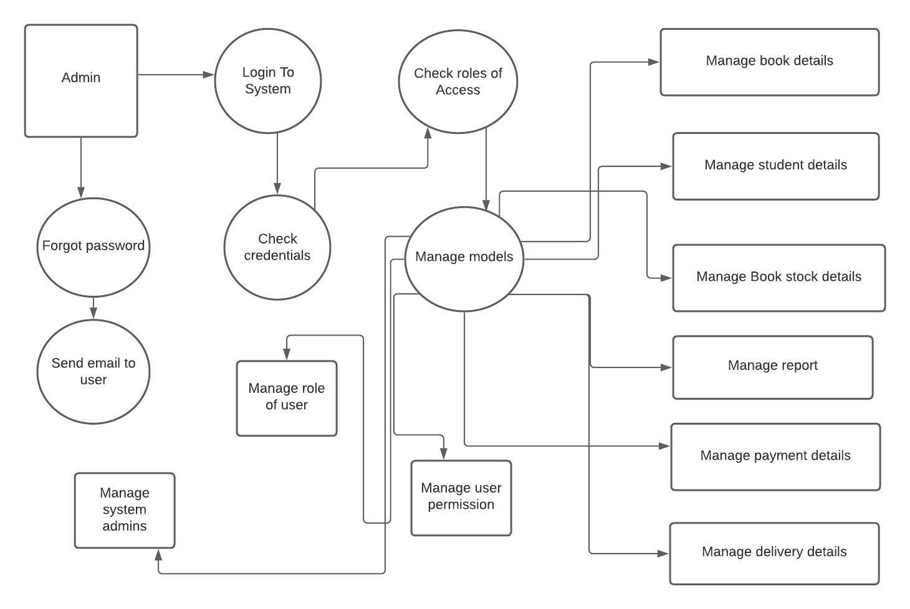

# Proposal for HAND-IN HAND-OUT

- Every university tend to hand out books to students based on their respective courses and intrests. If in case of books shortage or damaged books or other reasons the university tend to ask students to buy textbooks from other sources. After the year is done most of these books are either sold on other websites or students tend to recycle them. We intend to create an application to allow students to sell these books to the university on a certain percentage of the actual price so these books can be again issued by the university for new students.

 ## Overview:
 - We would like to develop an application that allows students to search for books they want to buy, rent, or check out, as well as sell them to the university. They will be given an appointment at their university library after filling out a form, where they can bring their book and sell it, which the admin will accept or reject depending on the book's availability.
 
## Benefits:
- This application would make it easy for students to check the availability of books that they would wish to check out or rent.
- Students can easily sell their books to the university.
- University can easily get more books, sometimes advanced editions from the students without spending more time to buy.

