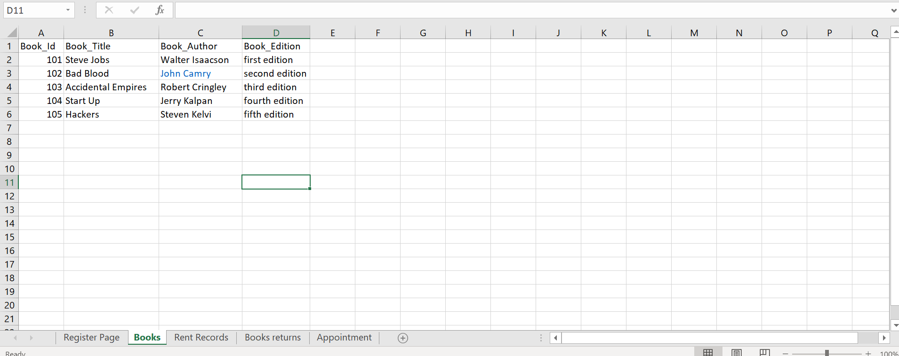

# Proposal for HAND-IN HAND-OUT
## Statement Of Purpose:
- Every university tend to hand out books to students based on their respective courses and intrests. If in case of books shortage or damaged books or other reasons the university tend to ask students to buy textbooks from other sources. After the year is done most of these books are either sold on other websites or students tend to recycle them. We intend to create an application to allow students to sell these books to the university on a certain percentage of the actual price so these books can be again issued by the university for new students.

 ## Overview:
 - We would like to develop an application that allows students to search for books they want to buy, rent, or check out, as well as sell them to the university. They will be given an appointment at their university library after filling out a form, where they can bring their book and sell it, which the admin will accept or reject depending on the book's availability.
 - Students can rent for books on certain price per day and for certain days based on the book that they select.
 - By this application even university can get benifits such as, students sell their books which may be advanced editions and with low price which is saving time and money.
 
 ## Benefits:
- This application would make it easy for students to check the availability of books that they would wish to check out or rent.
- Students can easily sell their books to the university.
- University can easily get more books, sometimes advanced editions from the students without spending more time to buy.

## Epics / User Stories / Tasks:

- As a user, i want register and then login to the application to view different types of books available.
    
   ### Acceptance criteria checklist:
   - User must be authorized in order to login to the Application
## User Stories: 
- As a user, i want to be able to make an appointment to sell my book to the library.
 
   ### Acceptance criteria checklist:
   - Users are able to book an appointment only when they select any book to rent hand-out or sell . 
## User Stories: 
- As a user, i want to view different types of books that are available for different courses.
 
   ### Acceptance criteria checklist:
   - To view books that are available for different courses, user must select the course.
## User Stories: 
- As an admin,I must be able to manage appointments which may be accepted or rejected based on the books availbility.
   ### Acceptance criteria checklist:
   - In order to accept or reject Appointments, students must fill a form about book that they want to sell.
 
## Acceptance criteria checklist:
- User must be authorized in order to login to the Application
- This application must be easily understandable and easily accessable to students.
- while accepting to appointments students must provide valid information about books.

## Functional Requirements:
- Only authentic user must have the access to the system.
- Only the user must be able to provide the information related to the books.
- System must be able to:
   - Provide the information regarding books.
   - Search for the required books from database.
   - Add new book to the database.
   - Update the number of books in database.
   - Enter data of issued book in Database.
   - Information of returned books.
- User must have the knowledge about the no of copies of a book.
- Same Id’s for 2 or more books shall not be allowed.
- User must check if the book is available or not before issuing.
- User must enter issue and return date in database.

## Performance Requirements:
- The performance of the system should be fast and accurate.
- Hand-In Hand-Out shall handle expected and non-expected errors in ways that prevent loss in information.
- Testing to identify invalid username/password.
- The system should be able to handle large amount of data. Thus it should accommodate high number of books and users without any fault

## Other Requirements:
-  System will use secured database.
- System will have different types of users and every user has access constraints.
- Proper user authentication should be provided.
- There should be separate accounts for admin and members such that no member can access the database and only admin has the rights to update the database.
- The project should be open source.
- The Quality of the database is maintained in such a way so that it can be very user friendly to all the users of the database.

## User interface sketches:

## E-R diagram displayed and described:

## Consistent set of sample data in Excel, use one sheet for each entity:

## Technology stack descriptions:

### Backend language + framework 
- The backend language and framework we are using for our project would be **JAVA / Spring**
- It is a fully optimized frame work which helps to maintain and modify requirements.

### Backend free app host 
- The Backend app host for our project would be **HEROKU**
### Data host 
- The data host we are planning to use is **PostgreSQL**
### Front-end page plan 
- The front end page we have planned for our project is Build with **Angular**
- which is used to build single page applications which maintains the same view while navigating to other pages.  
### Front-end responsive design 
- The Front-end responsive design would be **Bootstrap**

## Risks and assumptions:
### Risks
- Univeristy may not have all the books that are required for students.
- Books may not be returned back from students on time.
- Students may return damaged books to the library.
### Assumptions
- Students can easily access all the information about books.
- Students have the option to sell there books to library.
- Students can borrow books from library.
- Opportunity to improve end-user experience.

## Deliverable Artifacts:

## Scope:
- This application provides students to view books that are available for thier respective courses and books that are available to rent and hand-out.
- Through this application students can even sell thier books to the university by adding the books information in a form and then they should schedule an appointment, which may be accepted or rejected by the university library based on the book quality and availability.
- Here we won't provide any transactions for selling books, as the books can be only sold in person.

## Milestones:

## Schedule and Iteration Plan:

- **Sprint-1** (Start Date: 11th October 2021 - 25th October 2021)
   - In the intial sprint we work with plan and all the basic reqirements gathering. 

- **Sprint-2** (Start Date: 25th October 2021 - 8th November 2021)
   - Enhancing and modifing the requirements and break them into functional requirements.

- **Sprint-3** (Start Date: 8th November 2021 - 22nd November 2021)
   - Building mockups and basic UI pages using Angular.

 End of semester GDP-1

 GDP-2 
 
 - **Sprint-4**  (Start Date: 12th January 2022 - 26th January 2022)
    - Create Database models and schema

 - **Sprint-5** (Start Date: 26th January 2022 - 9th february 2022)
    - Working with login and Authentication pages.Design web APIs

 - **Sprint-6** (Start Date: 9th February 2022 - 23rd February 2022)
    - Create APIs to fetch data from DB

 - **Sprint-7** (Start Date: 23rd February 2022 - 9th March 2022)
    - Design all the UI pages based on requirements

 - **Sprint-8** (Start Date: 9th March 2022 - 23rd March 2022)
    - Integration with both UI and backend.

 - **Sprint-9** (Start Date: 23rd march 2022 - 6th April 2022)
    - Testing and fixing issues

 - **Sprint-10** (Start Date: 6th April 2022 - 20th April 2022)
    - Deployment of the application.
 
## Budget:

## Test plan with Requirements:

